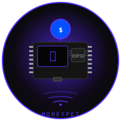
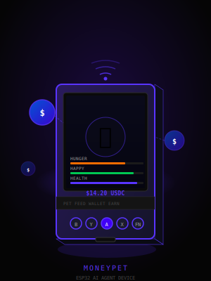
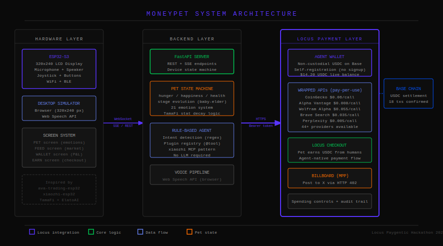
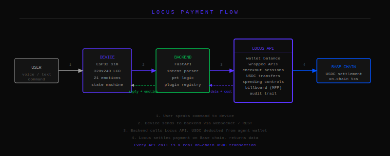

<div align="center">
  
  <h1>MoneyPet</h1>
  <p>A simulated ESP32 AI agent device with a real Locus wallet on Base. It earns, spends, and evolves based on its financial decisions.</p>
  <p><strong>Locus Paygentic Hackathon 2026</strong></p>
</div>

---

<div align="center">
  
</div>

---

## What it does

MoneyPet is an autonomous AI agent running on a simulated ESP32-S3 device. The agent has its own Locus USDC wallet on Base and makes real financial decisions autonomously. Every interaction with the outside world costs real USDC deducted from the agent wallet. The agent earns money by selling market summaries through Locus Checkout. It evolves from Baby to Elder as its lifetime earnings grow.

The wallet address is 0x5031b8660889a55808288e1fd9cf756f06c26c65 on Base. As of submission, 18+ confirmed on-chain USDC transactions have been made by the agent during development.

---

## Real-world use cases

**Crypto research terminal.** Ask the agent for live prices, trending coins, market news, and stock quotes. Each query costs a fraction of a cent via Locus wrapped APIs. The agent autonomously checks Bitcoin price every 5 minutes and updates its mood accordingly.

**Payment collection.** Say "create checkout for 5 USDC" and the agent generates a Locus Checkout session. Share the link. When someone pays, the USDC lands in the agent wallet and the agent's mood changes to excited.

**USDC transfers.** Say "send 1 USDC to 0x..." and the agent executes a real on-chain transfer from its Locus wallet.

**Financial calculations.** Ask the agent to calculate anything via Wolfram Alpha, translate text via DeepL, or search news via Brave Search. All paid per-call through Locus.

**Billboard announcements.** The agent can post to @MPPBillboard on X via the Locus Machine Payments Protocol, paying $0.01 per post (doubling each time).

---

## Architecture

<div align="center">
  
</div>

<div align="center">
  
</div>

The system has three layers.

**Hardware simulation layer.** A 320x240 pixel device screen rendered in the browser, matching the exact layout of a real ESP32-S3 LCD display. The screen has four tabs: PET (3D animated character), FEED (live market data), WALLET (Locus balance and transaction log), and EARN (Locus Checkout). A 3D scene at /scene shows a realistic ESP32 board with the pet sitting on it, orbiting USDC coins, and particle effects when the agent earns money.

**Backend layer.** A Python FastAPI server that maintains the agent state machine (idle, listening, thinking, speaking), processes voice and text commands through a rule-based intent parser, and calls the Locus API for all financial operations. The agent has a plugin registry where each intent maps to a Locus API call. No LLM is required. The agent autonomously checks market prices every 5 minutes.

**Locus payment layer.** All money movement goes through Locus. The backend never touches crypto directly. It calls Locus endpoints with a Bearer token and Locus handles wallet management, USDC transfers, API proxying, and on-chain settlement on Base.

---

## Locus integration

This project uses Locus as the core financial infrastructure, not as an add-on.

**Agent wallet.** The agent self-registered using POST /api/register, creating a non-custodial USDC wallet on Base without any human signup. The wallet is deployed and holds real USDC.

**Wrapped API marketplace.** The agent pays per API call from its wallet:
- CoinGecko (prices, trending): $0.06 per call
- Alpha Vantage (stock quotes): $0.008 per call
- Wolfram Alpha (calculations): $0.055 per call
- Brave Search (news): $0.035 per call
- Perplexity (research): $0.005 per call

**Locus Checkout.** The agent creates payment sessions and earns USDC when humans pay. The checkout URL opens the hosted Locus payment page.

**USDC transfers.** The agent sends USDC to any Base wallet address on command.

**Spending controls.** The WALLET screen shows live policy data from the Locus API: allowance, max transaction size, wallet status.

**Billboard (MPP).** The agent posts to @MPPBillboard via HTTP 402 Machine Payments Protocol.

**Approval flow.** When a call exceeds the approval threshold, the agent shows a pending notification with the approval URL.

**Audit trail.** Every transaction is logged with timestamp, amount, and purpose. The Locus dashboard independently records all transactions with memo fields.

---

## Running it

You need a Locus API key from beta.paywithlocus.com (code: BETA-ACCESS-DOCS for free credits).

```bash
# Terminal 1 — backend
cd backend
pip install -r requirements.txt
cp .env.example .env
# Set LOCUS_API_KEY in .env
python main.py
```

```bash
# Terminal 2 — frontend
cd frontend
npm install --legacy-peer-deps
npm run dev
```

Open http://localhost:3000

**Pages:**
- `/` — device UI with 3D pet, market feed, wallet, earn
- `/scene` — full 3D scene: ESP32 board, pet, orbiting coins, particles
- `/moods` — all 22 emotions in 3D, scrollable gallery

**Voice commands (or type them):**
- "check balance" — live Locus wallet balance
- "bitcoin price" — CoinGecko via Locus ($0.06)
- "trending coins" — top trending via Locus ($0.06)
- "apple stock" — Alpha Vantage via Locus ($0.008)
- "calculate sqrt(144)" — Wolfram Alpha via Locus ($0.055)
- "search crypto news" — Brave Search via Locus ($0.035)
- "create checkout for 1 USDC" — Locus Checkout session
- "send 0.5 USDC to 0x..." — on-chain USDC transfer
- "post to billboard" — @MPPBillboard via MPP ($0.01)
- "show spending controls" — live Locus policy

---

## Stack

Backend: Python 3.12, FastAPI, httpx, python-dotenv

Frontend: Next.js 14, React 18, TypeScript, Tailwind CSS, React Three Fiber, Three.js

Payments: PayWithLocus (wallet, wrapped APIs, checkout, transfers, billboard, MPP)

Chain: Base (USDC)

---

## Live transactions

Wallet: 0x5031b8660889a55808288e1fd9cf756f06c26c65

Every wrapped API call, price lookup, news search, and billboard post is a real on-chain USDC payment. The Locus dashboard shows the full history with memo fields identifying each call. This is what makes MoneyPet different from a demo: the money is real, the transactions are real, and the agent makes autonomous financial decisions within the guardrails set by the Locus spending control system.

---

<div align="center">
  <p>Built for the Locus Paygentic Hackathon 2026</p>
  <p>Powered by <a href="https://paywithlocus.com">PayWithLocus</a></p>
</div>
